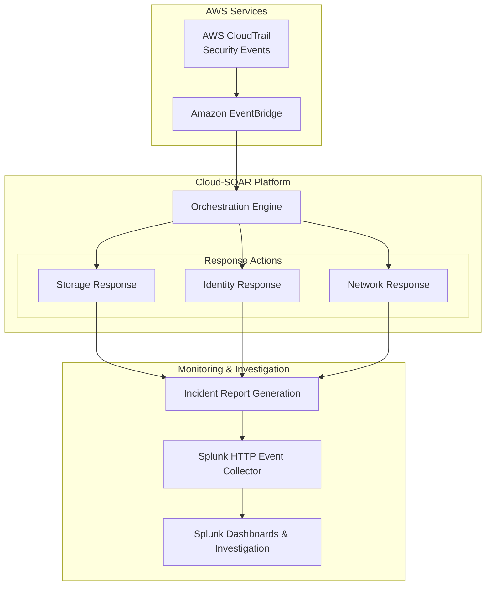

# Cloud Security Automation Framework (Cloud-SOAR)

> **A cloud-native Security Orchestration, Automation, and Response (SOAR) platform that continuously detects high-risk security events, executes deterministic remediation workflows, and forwards structured incident telemetry into Splunk SIEM for centralized security operations.**

Cloud Security Automation Framework (**Cloud-SOAR**) is an event-driven cloud security platform designed to automate the detection, containment, and reporting of common cloud security threats.

The platform continuously monitors cloud audit events, identifies security misconfigurations and unauthorized infrastructure changes, invokes dedicated remediation workflows, and generates structured incident records for centralized analysis within Splunk SIEM.

Cloud-SOAR follows a modular architecture where detection, orchestration, remediation, and SIEM integrations are separated into independent components, allowing new security controls and response workflows to be added without modifying the orchestration engine.

Although the repository provides a fully reproducible development environment using Terraform, Docker, and LocalStack, the platform itself is designed around native AWS services and can be deployed directly into an AWS environment with minimal architectural changes.

---

## Key Features

- **Security Event Orchestration**  
  Continuously monitors AWS CloudTrail events and routes security incidents through deterministic remediation pipelines.

- **Automated Incident Response**  
  Executes event-specific remediation workflows using the Cloud-SOAR orchestration engine.

- **Modular Security Controls**  
  Dedicated remediation modules for Storage, Identity, and Network security events.

- **Infrastructure as Code**  
  Complete infrastructure provisioning using Terraform for reproducible deployments .

- **Production & Local Deployment Support**  
  Deployable to AWS while supporting local development through Docker and LocalStack.

- **Centralized Security Visibility**  
  Structured incident telemetry is automatically forwarded into Splunk Enterprise using HTTP Event Collector (HEC).

- **MITRE ATT&CK Alignment**  
  Detection scenarios are mapped to industry-standard ATT&CK techniques.

- **Automated Attack Validation**  
  Includes an idempotent testing suite for validating end-to-end detection and remediation workflows.

---

## Current Detection Coverage

| MITRE Technique | Security Event | Automated Response |
|----------------|----------------|--------------------|
| **T1537 – Transfer Data to Cloud Account** | Public S3 Bucket ACL Modification | Revert bucket ACL to private |
| **T1098 – Account Manipulation** | Unauthorized AdministratorAccess policy attachment | Remove attached IAM policy |
| **T1021 – Remote Services** | SSH exposed to `0.0.0.0/0` | Remove insecure Security Group ingress rule |

---

## Platform Technologies

| Category | Technologies |
|----------|--------------|
| Cloud Platform | AWS (LocalStack) |
| Infrastructure | Terraform |
| Automation | AWS Lambda (Python) |
| Event Routing | Amazon EventBridge |
| Audit Logging | AWS CloudTrail |
| SIEM | Splunk Enterprise |
| Containerization | Docker & Docker Compose |
| SDK | boto3 |
| Language | Python 3 |

---

## Repository Structure

```text
cloud-soar/
├── lambda_soar/
│   ├── integrations/
│   ├── remediations/
│   └── lambda_function.py
│
├── scripts/
│   └── simulate_attacks.sh
│
├── splunk_setup/
│   ├── dashboards/
│   ├── docker-compose.yml
│   └── provision_splunk.sh
│
└── terraform/
    ├── base_infrastructure.tf
    ├── detections.tf
    ├── provider.tf
    ├── soar_engine.tf
    └── variables.tf
```

---

## High-Level Workflow


--- 


## Documentation

Cloud-SOAR documentation is organized into dedicated guides to keep the repository easy to navigate.

| Guide | Description |
|-------|-------------|
| **[Installation Guide](docs/INSTALL.md)** | Deploy Cloud-SOAR using Docker, LocalStack, Terraform, and Splunk Enterprise. |
| **Usage Guide** *(Coming Soon)* | Learn how to operate Cloud-SOAR and execute security workflows. |
| **Demo & Walkthrough** *(Coming Soon)* | End-to-end demonstrations with screenshots and attack simulations. |
| **Architecture Guide** *(Coming Soon)* | Deep dive into the platform architecture and event flow. |
| **Detection Catalog** *(Coming Soon)* | Detailed documentation for each supported detection and remediation workflow. |
| **Troubleshooting** *(Coming Soon)* | Common deployment issues and their resolutions. |

---
## Design Principles

Cloud-SOAR is built around several core engineering principles:

- **Modularity** – Detection, orchestration, remediation, and integrations remain loosely coupled.

- **Deterministic Automation** – Automated responses should be predictable, repeatable, and auditable.

- **Infrastructure as Code** – Platform resources are provisioned through Terraform to ensure reproducible deployments.

- **Observability** – Every remediation generates structured incident telemetry for centralized investigation.

- **Extensibility** – New detection rules and remediation modules can be introduced without modifying the orchestration engine.
--- 

## Current Release

Cloud-SOAR is currently capable of automatically detecting and remediating multiple high-risk AWS security misconfigurations while forwarding structured incident data into Splunk SIEM.

The current release focuses on building a stable and modular response engine. Future versions will expand the detection library, improve incident enrichment, introduce response verification, and support additional AWS services.

---

## Roadmap

### Detection Coverage

- Additional AWS service detections
- Custom detection rules
- Threat enrichment

### Response Automation

- Response verification
- Rollback support
- Incident severity engine

### Platform

- Slack Integration
- Teams Integration
- Multi-account AWS
- Plugin Architecture

### Observability

- Expanded Splunk dashboards
- Detection Analytics
- Operational Metrics

---